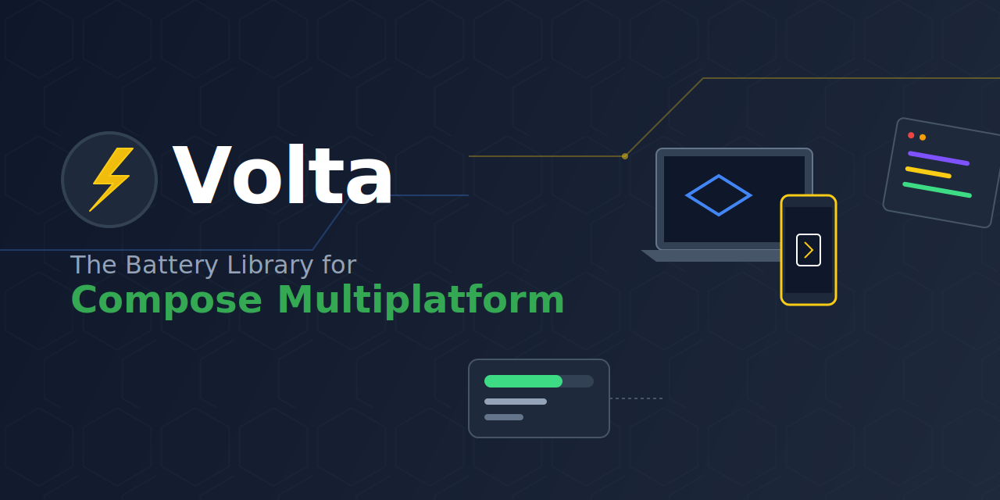

<p align="center">
  
</p>

<p align="center">
  <a href="https://github.com/techie-labs/Kameleoon/actions"></a>
  <a href="https://opensource.org/licenses/Apache-2.0"></a>
  <a href="https://kotlinlang.org"></a>
  <a href="https://www.jetbrains.com/lp/compose-multiplatform/"></a>
</p>

# Kameleoon 🦎

**Kameleoon** (derived from Chameleon) is an adaptive and comprehensive template for building **Compose Multiplatform Libraries** targeting Android, iOS, Desktop (JVM), and Web (Wasm). Just like a chameleon adapts to its environment, this template helps your UI code adapt seamlessly across platforms.

## Project Structure

* **`/library`**: The core module containing your shared library code.
    * `commonMain`: Code shared across all platforms.
    * `androidMain`, `iosMain`, `jvmMain`, `wasmJsMain`: Platform-specific implementations.
* **`/sample`**: A sample application to demonstrate and test your library.
    * Depends on the `:library` module.
    * Runs on Android, Desktop, and Web.

## Features & Tools included

* **Kotlin Multiplatform**: Pre-configured for Android, iOS, Desktop, and Web (Wasm).
* **Compose Multiplatform**: UI framework ready.
* **Maven Publish Plugin**: Easy publishing to Maven Central using `vanniktech/gradle-maven-publish-plugin`.
* **Binary Compatibility Validator**: Ensures your library's public API remains stable.
* **Dokka**: Generates API documentation.
* **Spotless**: Enforces code formatting (Ktlint) and license headers.
* **Detekt**: Static code analysis for Kotlin.
* **GitHub Actions**: CI/CD workflows for building, testing, and checking code quality.
* **Helper Scripts**: Easy setup and workflow management scripts in `/scripts`.

## Getting Started

### 1. Setup Environment

Run the setup script to prepare your local environment:
```shell
./scripts/setup.sh
```
This will create a `local.properties` file from a template, ensure `gradlew` is executable, and setup git hooks.

### 2. Rename and Configure
Update `library/build.gradle.kts` with your library's details:
* `mavenPublishing` block: Update `groupId`, `artifactId`, `version`, and `pom` details (licenses, developers, SCM).
* `android` block: Update `namespace`.

Update `spotless/copyright.kt` with your license header.

### 3. Build and Run Sample

**Android:**
```shell
./gradlew :sample:assembleDebug
```

**Desktop:**
```shell
./gradlew :sample:run
```

**Web (Wasm):**
```shell
./gradlew :sample:wasmJsBrowserRun
```

### 4. Code Quality Checks

Run the full workflow script to check everything at once:
```shell
./scripts/run-workflow.sh
```

Or run individually:
*   **Format Code:** `./gradlew spotlessApply`
*   **Static Analysis:** `./gradlew detekt`
*   **API Check:** `./gradlew apiCheck`
*   **Documentation:** `./gradlew dokkaHtml`

### 5. Publishing

To publish to Maven Central, you need to configure your Sonatype credentials.
The project is set up to use the `vanniktech` plugin. Refer to the [plugin documentation](https://github.com/vanniktech/gradle-maven-publish-plugin) for setting up secrets (GPG key, Sonatype username/password).

A manual workflow is available at `.github/workflows/publish.yml`.

## Contributing

Please read [CONTRIBUTING.md](CONTRIBUTING.md) for details on our code of conduct, and the process for submitting pull requests to us.

---

## License

[Add your license here]
