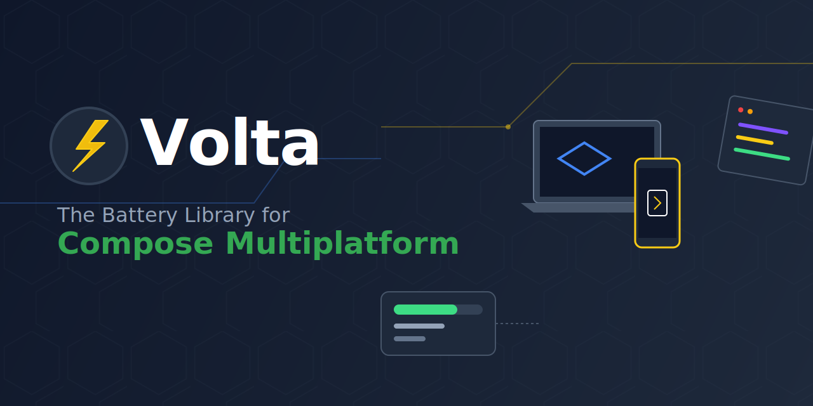

<p align="center">
  
</p>

<p align="center">
  <a href="https://github.com/techie-labs/Volta/actions/workflows/build.yml"></a>
  <a href="https://opensource.org/licenses/Apache-2.0"></a>
  <a href="https://kotlinlang.org"></a>
  <a href="https://www.jetbrains.com/lp/compose-multiplatform/"></a>
  <a href="https://central.sonatype.com/artifact/io.github.techie-labs/volta"></a>
</p>

# Volta ⚡ — Kotlin Multiplatform Battery Library

**Volta** is a powerful, reactive battery intelligence library for **Kotlin Multiplatform (KMP)** and **Compose Multiplatform**. 

Monitor battery health, charging status, and advanced diagnostics across **Android**, **iOS**, and **Desktop** (Windows, macOS, Linux) with a single, unified API. Stop writing platform-specific code for battery monitoring and start using Volta.

## ✨ Key Features

*   **Unified KMP API**: One interface for Android, iOS, and Desktop battery monitoring.
*   **Reactive State Management**: Built on Kotlin `StateFlow` for seamless integration with modern UI architectures.
*   **Deep Battery Diagnostics**: Access advanced data like **Cycle Count**, **Current (mA)**, **Voltage**, **Temperature**, and **Battery Technology**.
*   **Smart Status Detection**: Automatically detect **Power Saving Mode**, **Safe Mode**, and **Protected Battery** (80% limit) states.
*   **Compose Multiplatform Ready**: Includes the `rememberBatteryState()` hook for instant UI updates.
*   **Lightweight & Native**: Uses native system APIs (Android BatteryManager, iOS UIDevice, Windows WMIC, macOS pmset) for maximum efficiency.

## 📦 Installation

Add Volta to your `commonMain` dependencies in your `build.gradle.kts` file:

```kotlin
commonMain.dependencies {
    // Core hardware logic (Required)
    implementation("io.github.techie-labs:volta:1.0.0-rc01")
    
    // Optional: Ready-to-use Compose Widgets
    implementation("io.github.techie-labs:volta-ui-compose:1.0.0-rc01")
    
    // Optional: Mock provider for Previews and Unit Tests
    implementation("io.github.techie-labs:volta-mock:1.0.0-rc01")
}
```

## 🚀 Quick Start

### 1. Using with Compose Multiplatform

Get reactive battery updates in your UI with just one line of code:

```kotlin
import androidx.compose.runtime.getValue
import io.techie.volta.compose.rememberBatteryState
import io.techie.volta.VoltaSensorState

@Composable
fun BatteryDashboard() {
    val sensorState by rememberBatteryState()

    when (sensorState) {
        is VoltaSensorState.Loading -> Text("Connecting to battery sensor...")
        is VoltaSensorState.PermissionDenied -> Text("⚠️ Please grant battery permissions.")
        is VoltaSensorState.HardwareNotSupported -> Text("⚠️ Battery sensor not supported on this device.")
        is VoltaSensorState.Available -> {
            val battery = (sensorState as VoltaSensorState.Available).data
            Column {
                Text("Battery Level: ${battery.level}%")
                Text("Charging Status: ${battery.chargingStatus}")

                if (battery.isPowerSavingMode) {
                    Text("⚠️ Low Power Mode is ON")
                }
            }
        }
        else -> Text("Unknown sensor state")
    }
}
```

### 2. Using in Kotlin Multiplatform (ViewModel/Logic)

Observe battery changes in your business logic:

```kotlin
import io.techie.volta.VoltaFactory
import io.techie.volta.VoltaSensorState

class BatteryViewModel {
    // 1. Create a platform-specific instance via Factory
    private val volta = VoltaFactory.create()

    init {
        // 2. Start monitoring hardware events
        volta.startMonitoring()
        
        viewModelScope.launch {
            // 3. Collect state safely
            volta.batteryState.collect { state ->
                if (state is VoltaSensorState.Available) {
                    println("Current Level: ${state.data.level}%")
                }
            }
        }
    }
}
```

### 3. Using Pre-built Compose Widgets (`volta-ui-compose`)

If you don't want to build battery UI from scratch, use our plug-and-play components:

```kotlin
import io.techie.volta.ui.VoltaBatteryIcon
import io.techie.volta.ui.ThermalWarningBanner
import io.techie.volta.VoltaSensorState

@Composable
fun BatteryDashboard() {
    val sensorState by rememberBatteryState()

    if (sensorState is VoltaSensorState.Available) {
        val battery = (sensorState as VoltaSensorState.Available).data
        Column {
            // Dynamic vector icon that fills up and changes color
            VoltaBatteryIcon(state = battery, modifier = Modifier.height(32.dp).width(64.dp))
            
            // Auto-appearing banner when device overheats (>= 45°C)
            ThermalWarningBanner(state = battery)
        }
    }
}
```

## 🛠️ Developer Tools

Volta includes advanced tools to help you build battery-efficient apps.

### 1. Smart Sync (Execution Engine)
Safely execute heavy background tasks (like syncing or AI processing) only when hardware conditions are optimal.

```kotlin
import io.techie.volta.devtools.*

val condition = ExecutionCondition(
    minBatteryLevel = 20,
    requiresCharging = true,
    maxTemperatureC = 40.0f
)

// Suspend your coroutine until conditions are met
batteryProvider.whenOptimal(condition) {
    // Run your heavy ML model or sync job here
    syncData()
}
```

### 2. Battery Profiler
Track battery consumption for specific user sessions or tasks.

```kotlin
import io.techie.volta.devtools.BatteryProfiler

val profiler = BatteryProfiler(batteryProvider)

// Start tracking before a heavy operation
profiler.startSession("VideoProcessing")

// ... do heavy work ...

// Stop tracking and get a comprehensive report
val report = profiler.stopSession("VideoProcessing")
val drop = (report?.startBatteryPercent ?: 0) - (report?.endBatteryPercent ?: 0)
println("Battery dropped by $drop% during video processing.")
```

### 3. Diagnostic Dump
Get an instant, flat map of all battery states for crash reporting or logging.

```kotlin
import io.techie.volta.diagnostics.getDiagnosticDump

val dump = batteryState.getDiagnosticDump()
// Example: crashlytics.setCustomKeys(dump)
```

### 4. UI Testing & Previews (`volta-mock`)

Use `VoltaMock` to simulate hardware states in Compose Previews without physical devices:

```kotlin
import io.techie.volta.mock.VoltaMock
import io.techie.volta.core.BatteryState
import io.techie.volta.VoltaSensorState

@Preview
@Composable
fun LowBatteryPreview() {
    val mockVolta = VoltaMock()
    mockVolta.setBatteryLevel(10)
    mockVolta.setCharging(false)
    mockVolta.setPowerSavingMode(true)
    
    // Test the specific UI state explicitly:
    val mockState = VoltaSensorState.Available(mockVolta.getBatteryState())
    // Provide to your UI component...
}
```

## 📱 Platform Support & Permissions

### 🤖 Android
*   **Min SDK**: 24 (Android 7.0)
*   **Permissions**: Add `<uses-permission android:name="android.permission.BATTERY_STATS" />` for full diagnostics.
*   **Note**: Cycle Count requires Android 14+.

### 🍎 iOS
*   **Permissions**: None required.
*   **Note**: iOS limits access to hardware-level stats like temperature and voltage for third-party apps.

### 🖥️ Desktop (JVM)
*   **Windows**: Uses `wmic` and `powercfg`.
*   **macOS**: Uses `pmset` and `system_profiler`.
*   **Linux**: Reads from `/sys/class/power_supply/`.

### 🌐 Web (Wasm)
*   **API**: HTML5 Battery Status API (`navigator.getBattery()`).
*   **Note**: Privacy-focused. Only exposes Level, Charging Status, and Time Remaining. Advanced metrics (Temperature, Voltage, Cycles) are strictly limited by browsers to prevent fingerprinting.

## 📊 Feature Matrix

| Feature | Android 🤖 | iOS 🍎 | Windows 🪟 | macOS 🍏 | Web (Wasm) 🌐 |
| :--- | :---: | :---: | :---: |:--------:|:--------:|
| **Level & Status** | ✅ | ✅ | ✅ |    ✅     |    ✅     |
| **Power Saving** | ✅ | ✅ | ❌ |    ❌     |    ❌     |
| **Voltage** | ✅ | ❌ | ❌ |    ✅     |    ❌     |
| **Temperature** | ✅ | ❌ | ❌ |    ✅     |    ❌     |
| **Technology** | ✅ | ❌ | ❌ |    ✅     |    ❌     |
| **Cycles** | ✅ (14+) | ❌ | ✅ |    ✅     |    ❌     |
| **Current (Now)** | ✅ | ❌ | ❌ |    ✅     |    ❌     |
| **Safe Mode** | ✅ | ❌ | ❌ |    ❌     |    ❌     |
| **Time Remaining** | ❌ | ❌ | ❌ |    ✅     |    ✅     |
| **Capacity** | ✅ | ❌ | ❌ |     ✅     |    ❌     |

## 🧪 Testing

Volta includes comprehensive unit tests for its core logic. The CI pipeline runs these tests on every push to ensure stability.

```bash
./gradlew allTests
```

## 🤝 Contributing

Contributions are welcome! Please read our [CONTRIBUTING.md](CONTRIBUTING.md) to get started.

## 📄 License

Volta is open-source software licensed under the [Apache 2.0 License](LICENSE).

---
<p align="center">
  Built with ⚡ by <a href="https://github.com/techie-labs">Techie Labs</a>
</p>
